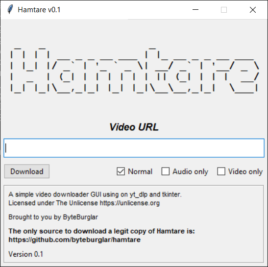

# Hamtare

Hamtare (Swedish for Fetcher) is the best (and only) GUI to download videos, using yt-dlp and tkinter, in < 200 lines of Python.

<p align="center">
  
</p>

## Download

Download the appropriate release for you from the [releases page](https://github.com/byteburglar/hamtare/releases/).

## Running locally

```bash
git clone https://github.com/byteburglar/hamtare.git
cd hamtare
pip install -r src/requirements.txt
python src/hamtare.py
```

## License

Licensed under [The Unlicense](https://unlicense.org/), knock yourself out!

<i>The ByteBurglar</i>
